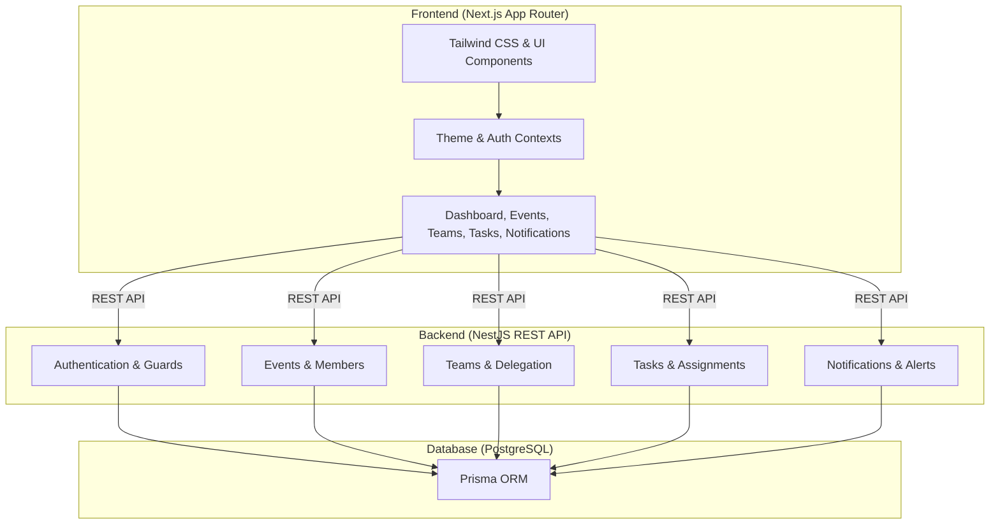

# RunSheet - Event Operations & Execution Management System

<div align="center">

[](https://opensource.org/licenses/MIT)
[](https://www.typescriptlang.org/)
[](https://nextjs.org/)
[](https://nestjs.com/)
[](https://www.prisma.io/)
[](https://www.postgresql.org/)
[](https://tailwindcss.com/)

**A modern, full-stack event planning, team delegation, and execution management platform built with Next.js, NestJS, and PostgreSQL.**

[Features](#-key-features) • [Architecture](#-system-architecture) • [Getting Started](#-getting-started) • [API Overview](#-api-overview) • [License](#-license)

</div>

---

## 📖 Overview

**RunSheet** is an event management platform designed to streamline event lifecycles from preliminary planning to execution.

With scoped **Role-Based Access Control (RBAC)**, team delegation, task tracking, notifications, and progress dashboards, RunSheet helps event organizers and crew members coordinate and manage operations effectively.

---

## ✨ Key Features

| Domain | Highlights |
| :--- | :--- |
| 🛡️ **Authentication & Access** | Secure user registration and login with token-based authorization and event invitation workflows. |
| 📅 **Event Lifecycle Management** | Track and transition event states (`Draft`, `Planning`, `Active`, `Completed`, `Cancelled`, `Archived`), venue details, and schedules. |
| 👥 **Scoped Role-Based Access** | Event-level permissions for **Organizers**, **Team Leaders**, and **Members**. |
| 🏢 **Team Hierarchy & Delegation** | Create departments/teams per event (e.g., Logistics, Stage, AV, Operations) and appoint leaders. |
| 📋 **Task Scheduling & Tracking** | Organize tasks by priority (`Low`, `Medium`, `High`, `Critical`), status lifecycle, and due dates. |
| 🎯 **Task Assignments** | Assign crew members to tasks and monitor real-time completion status. |
| 🔔 **Notification Hub** | In-app alerts for task updates, assignment changes, event invitations, and reminders. |
| 📊 **Dashboards & Analytics** | High-level metrics for event progress, task completion rates, and team workloads. |
| 🌓 **Modern Responsive UI** | Clean interface built with Next.js App Router, Tailwind CSS, and light/dark theme support. |

---

## 🏗️ System Architecture



---

## 📁 Repository Structure

```
RunSheet/
├── backend/                  # NestJS API Application
│   ├── prisma/               # Database schema & migrations
│   ├── src/
│   │   ├── auth/             # Authentication & authorization guards
│   │   ├── dashboard/        # Dashboard metrics & reporting
│   │   ├── events/           # Event management
│   │   ├── event-members/    # Event roster & member handling
│   │   ├── invitations/      # Invitation services
│   │   ├── notifications/    # Notification handlers & schedulers
│   │   ├── tasks/            # Task scheduling & status tracking
│   │   ├── task-assignments/ # Member task delegation
│   │   ├── teams/            # Team creation & management
│   │   ├── team-memberships/ # Team member assignment
│   │   └── users/            # User account management
│   └── package.json
│
├── frontend/                 # Next.js Web Client
│   ├── src/
│   │   ├── app/              # App Router pages (Auth & Dashboard)
│   │   ├── components/       # Reusable UI component library
│   │   ├── features/         # Feature-specific components
│   │   ├── hooks/            # Custom React hooks
│   │   ├── providers/        # Application context providers
│   │   └── services/         # API integration services
│   └── package.json
│
├── LICENSE                   # MIT License
└── README.md                 # Project Documentation
```

---

## 🚀 Getting Started

### Prerequisites

- **Node.js**: `v18+` or `v20+`
- **npm**, **yarn**, or **pnpm**
- **PostgreSQL** Database instance

---

### Installation & Setup

1. **Clone the repository:**
   ```bash
   git clone https://github.com/bhagyasandakelum/RunSheet.git
   cd RunSheet
   ```

2. **Backend Setup:**
   ```bash
   cd backend
   npm install
   ```
   - Set up your database connection and environment configuration in a `.env` file.
   - Run database migrations:
     ```bash
     npx prisma migrate dev
     npx prisma generate
     ```
   - Start the backend server:
     ```bash
     npm run start:dev
     ```

3. **Frontend Setup:**
   ```bash
   cd ../frontend
   npm install
   ```
   - Set up your environment variables for the API URL in `.env.local`.
   - Start the development server:
     ```bash
     npm run dev
     ```

---

## 📡 API Overview

| Module | Purpose |
| :--- | :--- |
| **Auth** | User registration, authentication, and profile endpoints |
| **Events** | Create, view, update, and manage events |
| **Members & Invitations** | Manage event rosters, invite participants, and handle invitations |
| **Teams** | Create departments and assign team memberships |
| **Tasks & Assignments** | Create tasks, manage priority/status, and delegate assignments |
| **Notifications** | Retrieve activity notifications and mark items as read |
| **Dashboard** | Overview statistics and activity summaries |

---

## 🧪 Testing & Code Quality

### Backend
```bash
cd backend
npm run test          # Run unit tests
npm run test:e2e      # Run e2e tests
```

### Frontend
```bash
cd frontend
npm run lint          # Run linter
```

---

## 🤝 Contributing

Contributions, issues, and feature requests are welcome!

1. Fork the Project
2. Create your Feature Branch (`git checkout -b feature/NewFeature`)
3. Commit your Changes (`git commit -m "feat: Add NewFeature"`)
4. Push to the Branch (`git push origin feature/NewFeature`)
5. Open a Pull Request

---

## 📄 License

This project is open-source and licensed under the **MIT License** — see the [LICENSE](file:///c:/Young%20Protege/RunSheet/LICENSE) file for details.
